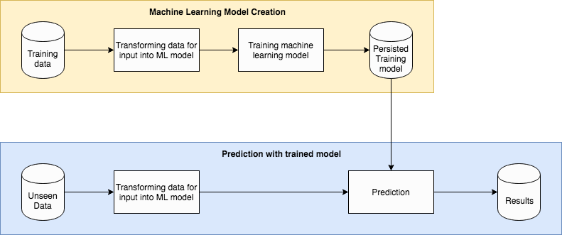
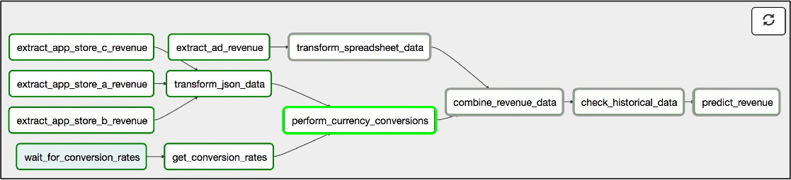
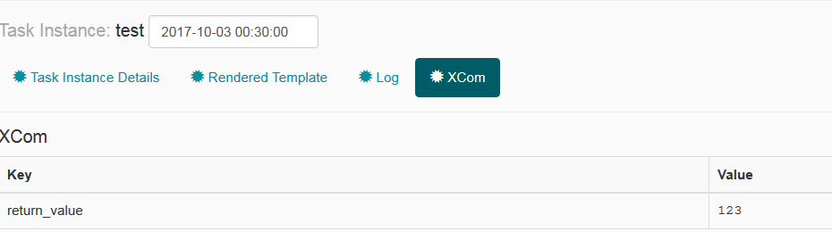
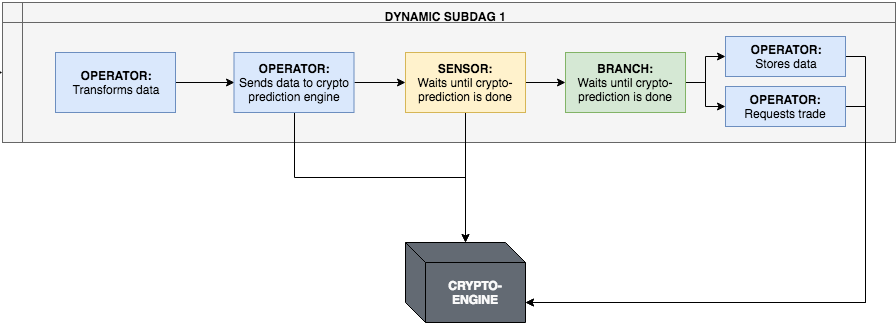

<!-- .slide: data-background="images/network-background.jpg" class="background" -->

<h2>Industrial Machine Learning</h2>
<h4>Horizontally Scalable Data Pipelines with Airflow</h4>
<p>
  <br />
  <br />
    Alejandro Saucedo <br/><br/>
    <a href="http://twitter.com/AxSaucedo">@AxSaucedo</a><br/>
    <a href="http://linkedin.com/in/AxSaucedo">in/axsaucedo</a><br/>
  <br />
</p>
<p>

[NEXT]
<!-- .slide: data-background="images/network-background.jpg" class="background" -->

<h2>Industrial Machine Learning</h2>

<h4>Horizontally Scalable Data Pipelines with Airflow</h4>

<table class="bio-table">
  <tr>
    <td style="float: left">
        
        <br>
        <font style="font-weight: bold; color: white">Alejandro Saucedo</font>
        <br>
        <br>
    </td>
    <td style="float: left; color: white; font-size: 0.7em;">

        <br>
        Head of Solutions Engineering
        <br>
        <a style="color: cyan" href="http://eigentech.com">Eigen Technologies</a>
        <br>
        <br>
        Chairman
        <br>
        <a style="color: cyan" href="http://ethical.institute">The Institute for Ethical AI & ML</a>
        <br>
        <br>
        Member, Broader AI Expert Group
        <br>
        <a style="color: cyan" href="#">European Commission</a>
        <br>
        <br>
        Advisory group
        <br>
        <a style="color: cyan" href="http://teensinai.com">TeensInAI</a>
        <br>

    </td>
  </tr>
  <tr>
  </tr>
</table>

### <a style="color: cyan" href="#">Contact me at: a@e-x.io</a>
    
[NEXT]
<!-- .slide: data-background="images/network-background.jpg" class="background smallquote" -->

# Eigen Technologies

> Building large scale ML for text analysis
> <br>
> <br>
> Large scale front- & back-office automation
>
> Mainly operating in Finance, Insurance & Legal
>
> Recently raised $17.5m to expand R&D & scale

<br>
### PS. We are hiring -> <a href="http://eigentech.com">eigentech.com</a>


[NEXT]
<!-- .slide: data-background="images/network-background.jpg" class="background smallquote" -->

#### The Institute for Ethical AI & ML
<iframe style="height: 50vh; width: 100vw" src="http://ethical.institute"></iframe>
#### <a href="http://ethical.institute">http://ethical.institute</a>


    
[NEXT]
<!-- .slide: data-background="images/network-background.jpg" class="background smallquote" -->

## Today: Industry-ready ML

> Overview  & caveats in scaling data pipelines
> <br>
> <br>
> Airflow components (Celery, ML models, etc)
>
> Introducing difference between ML & Data Pipelines
>
> Overview of Airflow + Usecase

### The big picture


[NEXT]
<!-- .slide: data-background="images/network-background.jpg" class="background smallquote" -->

# Learning by example

> Today we are...

## Building a tech startup

[NEXT]
<!-- .slide: data-background="images/network-background.jpg" class="background smallquote" -->

# Crypto-ML Ltd.

> Let's jump the hype-train! 
> <br>
> <br>
> A large scale <font style="color: cyan">crypto-analysis</font> platform
>
> Heavy compute <font style="color: cyan">data analysis, Transform, Fetch...</font> 
>
> Going deep running <font style="color: cyan">predictions on LSTMs</font>
>

<br>
#### Can we survive the 2017 <font style="color: cyan">crypto-craze?</font>

[NEXT]
<!-- .slide: data-background="images/network-background.jpg" class="background smallquote" -->

# The Dataset

> All historical data from top 100 cryptos
>
> Data goes from beginning to 09/2017

> 563871 daily-price (close) points 


[NEXT]
<!-- .slide: data-background="images/network-background.jpg" class="background smallest" -->

## Interface: CryptoLoader

<pre><code class="code python hljs" style="font-size: 1em; line-height: 1em">
from crypto_ml.data_loader import CryptoLoader cl

loader = cl()

loader.get_prices("bitcoin")
> array([ 134.21,  144.54,  139.  , ..., 3905.95, 3631.04, 3630.7 ])


loader.get_df("bitcoin").head()
>            Date    Open    High     Low   Close     Market Cap
> 1608 2013-04-28  135.30  135.98  132.10  134.21  1,500,520,000
> 1607 2013-04-29  134.44  147.49  134.00  144.54  1,491,160,000
> 1606 2013-04-30  144.00  146.93  134.05  139.00  1,597,780,000
> 1605 2013-05-01  139.00  139.89  107.72  116.99  1,542,820,000
> 1604 2013-05-02  116.38  125.60   92.28  105.21  1,292,190,000

</code></pre>

<div class="clear-col"></div>


[NEXT]
<!-- .slide: data-background="images/network-background.jpg" class="background smallest" -->

## Interface: CryptoManager

<pre><code class="code python hljs" style="font-size: 1em; line-height: 1em">
from crypto_ml.manager import CryptoManager as cm

manager = cm()

manager.send_tasks()

> bitcoin [[4952.28323284 5492.85474648 6033.42626011 6573.99777374 7114.56928738
> 7655.14080101 8195.71231465 8736.28382828 9276.85534192 9817.42685555]]
> bitconnect [[157.70136155 181.86603134 206.03070113 230.19537092 254.36004071
> 278.5247105  302.6893803  326.85405009 351.01871988 375.18338967]]

</code></pre>

<div class="clear-col"></div>

<!-- .element style="color: white;" -->

[NEXT]
<!-- .slide: data-background="images/network-background.jpg" class="background" -->
### Code
https://github.com/axsauze/crypto-ml

### Slides
http://github.com/axsauze/industrial-airflow


[NEXT]
## #LetsDoThis

[NEXT SECTION]
# 1. The Early Crypto-Beginnings

[NEXT]

Crypto-ML Ltd. managed to obtain access to a unique dataset, which allowed them
to build their initial prototype and raise massive amounts of VC money

<pre><code class="code python hljs" style="font-size: 1em; line-height: 1em">
import random

def predict_crypto(self, crypto_data):
    # I have no clue what I'm doing
    return crypto_data * random.uniform(0, 1)

</code></pre>

<br>

### Now they need to figure out what ML is

[NEXT]

### ML Tutorials Everywhere


[NEXT]

## They learned, it's basically

automatically learning from data examples

to predict an output based on an input


**e.g. telling whether a shape is a square or a triangle **

by learning from examples


[NEXT]
## More specifically

* Imagine a 2-d plot
* The x-axis is the area of the input shape
* The y-axis is the perimeter of the input shape


[NEXT]
## We want to learn a function
<br>

<div class="left-col">
**$f(x̄) = mx̄ + b$**
<br>
<br>
where:
<br>
<br>
**x̄** is input (area & perimeter) </li>
<br>
<br>
**m** and **b** are weights/bias
<br>
</div>


[NEXT]

## So we can predict new data


The result **$f(x̄)$** states whether it's a triangle or square
<br>
<br>
(e.g. if it's larger than 0.5 it's triangle otherwise square)


[NEXT]
<!-- .slide: data-transition="slide-in fade-out" -->
## The machine does the learning


We give it two examples (one square, one triangle)

[NEXT]
<!-- .slide: data-transition="fade-in" -->
## The machine does the learning


We give it more examples

[NEXT]
<!-- .slide:data-transition="fade-in slide-out" -->
## The machine does the learning


and more...


[NEXT]
### By minimising its cost function


Keep learning by adjusting the weights...

...until our function becomes more accurate


[NEXT]
<!-- .slide: data-transition="slide-in fade-out" -->
## We are able to find the weights


When it finishes, we find optimised weights and biases

i.e. **$f(x̄)$ = triangle  if ($0.3 x̄ + 10$) > 0.5 else square**

[NEXT]
<!-- .slide: data-transition="fade-in slide-out" -->
### And predict output of unseen inputs


We now have a system that "knows" how to differentiate triangles from squares


[NEXT]
The Crypto-ML devs asked themselves...

<pre><code class="code python hljs" style="font-size: 1em; line-height: 1em">
from crypto_ml.data_loader import CryptoLoader

btc = CryptoLoader().get_df("bitcoin")

btc.head()

>            Date    Open    High     Low   Close     Market Cap
> 1608 2013-04-28  135.30  135.98  132.10  134.21  1,500,520,000
> 1607 2013-04-29  134.44  147.49  134.00  144.54  1,491,160,000
> 1606 2013-04-30  144.00  146.93  134.05  139.00  1,597,780,000
> 1605 2013-05-01  139.00  139.89  107.72  116.99  1,542,820,000
> 1604 2013-05-02  116.38  125.60   92.28  105.21  1,292,190,000


</code></pre>

...can this be used for our cryptocurrency price data?


[NEXT]
# Not yet.

Processing sequential data requires a different approach.
<br>
<br>

Instead of trying to predict two classes...

...we want to predict future steps
<br>
<br>


[NEXT]
# Sequential Models

Sequential models often are used to predict future data.

<div class="left-col">

</div>

<div class="right-col">
Still uses the same approach
<br>

`f(x) = mx + b`  
<br>
To find the weights and biases
<br>
<br>

But can be used on time-sequence data - ie. prices, words, characters, etc.
</div>


[NEXT]

# Linear Regression
The hello_world of sequential models


Predicting prices by fitting a line on set of time-series points

[NEXT]

If we use this, the predicted bitcoin price would be
## A million++ in months


Not that people didn't do it...


[NEXT]
And the Crypto-ML wanted to go full hype...

# Deep Neural Networks

indeed...


[NEXT]

#### They learned that Neural Network neurons 
### have the same function!


`f(x) = mx + b`
<br>


The perceptron function


[NEXT]
### So they tooked one neuron


[NEXT]
### And added more


To allow for more complex functions


[NEXT]
### With a few layers


To give more flexibility for learning

[NEXT]

### Then found some deep learning tutorials


[NEXT]
### And added many more hidden layers


[NEXT]

Specifically for sequential models?
## Deep Recurrent Neural Networks
# (e.g. LSTMs)


[NEXT]
### Unrolled Network for Sequential Data

We just try to predict the next time step


The output of each node is fed with the next input.
This allows the network to "hold memory"

[NEXT]

### Loss/Cost function
Cost function is based on getting the prediction right!


[NEXT]
## That's great

But how do we put this into practice?

[NEXT SECTION]
# 2. Machine Learning Pipelines

[NEXT]
The Crypto-ML team realised copy pasting code from 

### Stack overflow

wasn't enough...


[NEXT]

They had to do it properly, so they learned how to build their

## Machine Learning Pipeline

[NEXT]
<!-- .slide: data-transition="slide-in fade-out" -->
## They found it breaks into



**Model training/creation** and then **prediction with model**

[NEXT]
<!-- .slide: data-transition="fade-in fade-out" -->
This breaks down into 1) "learning the function"


[NEXT]
<!-- .slide: data-transition="fade-in slide-out" -->
And then, "using our function to predict" unseen inputs


[NEXT]
<!-- .slide: data-transition="fade-in slide-out" -->
#### Important: Data transformation & Features


* Focus on improving your "feature space"
    * This is basically how you represent your data
        * e.g. squares/triangles == area + perimeter

    * And what other useful features can you get from it
        * e.g. color, number of corners, etc

[NEXT]
<!-- .slide: data-transition="fade-in slide-out" -->
#### Important: ML Model Training


* Furthermore, training the model requires:
    * A representative sample of training data

    * Reasonable methods to assess accuracy

    * A relevant model for the type of prediction


[NEXT]
### We're ML experts!

Please collect your certificates after the talk
<br>
<br>

These are valid in:

* Your Linkedin profile
* Non-tech Meetups and Parties
* Any time you reply to a tweet


[NEXT]
# Time to build our pipeline

[NEXT]
<!-- .slide: data-transition="slide-in fade-out" -->
## Linear Regression ML Pipeline

<pre><code class="code python hljs" style="font-size: 1em; line-height: 1em">
from sklearn import linear_model

def predict(prices, times, predict=10): 

    model = linear_model.LinearRegression() 

    model.fit(times, prices) 

    predict_times = get_prediction_timeline(times, predict) 

    return model.predict(predict_times) 

</code></pre>

Very simple to implement using scikit-learn

[NEXT]
<!-- .slide: data-transition="fade-in fade-out" -->
## Linear Regression ML Pipeline

<pre><code class="code python hljs" style="font-size: 1em; line-height: 1em">
from sklearn import linear_model

# <- Get your transformed data
def predict(prices, times, predict=10): 

    model = linear_model.LinearRegression() 

    model.fit(times, prices) 

    predict_times = get_prediction_timeline(times, predict) 

    return model.predict(predict_times) 

</code></pre>

Very simple to implement using scikit-learn


[NEXT]
<!-- .slide: data-transition="fade-in fade-out" -->
## Linear Regression ML Pipeline

<pre><code class="code python hljs" style="font-size: 1em; line-height: 1em">
from sklearn import linear_model

# <- Get your transformed data
def predict(prices, times, predict=10): 

    # <- Select your model
    model = linear_model.LinearRegression() 

    model.fit(times, prices) 

    predict_times = get_prediction_timeline(times, predict) 

    return model.predict(predict_times) 

</code></pre>

Very simple to implement using scikit-learn


[NEXT]
<!-- .slide: data-transition="fade-in fade-out" -->

## Linear Regression ML Pipeline

<pre><code class="code python hljs" style="font-size: 1em; line-height: 1em">
from sklearn import linear_model

# <- Get your transformed data
def predict(prices, times, predict=10): 

    # <- Select your model
    model = linear_model.LinearRegression() 

    # <- Train your model
    model.fit(times, prices) 

    predict_times = get_prediction_timeline(times, predict) 

    return model.predict(predict_times) 

</code></pre>

Very simple to implement using scikit-learn

[NEXT]
<!-- .slide: data-transition="fade-in fade-out" -->

## Linear Regression ML Pipeline

<pre><code class="code python hljs" style="font-size: 1em; line-height: 1em">
from sklearn import linear_model

# <- Get your transformed data
def predict(prices, times, predict=10): 

    # <- Select your model
    model = linear_model.LinearRegression() 

    # <- Train your model
    model.fit(times, prices) 

    # <- Choose unseen datapoints in the right format
    predict_times = get_prediction_timeline(times, predict) 

    return model.predict(predict_times) 

</code></pre>

Very simple to implement using scikit-learn


[NEXT]
<!-- .slide: data-transition="fade-in slide-out" -->

## Linear Regression ML Pipeline

<pre><code class="code python hljs" style="font-size: 1em; line-height: 1em">
from sklearn import linear_model

# <- Get your transformed data
def predict(prices, times, predict=10): 

    # <- Select your model
    model = linear_model.LinearRegression() 

    # <- Train your model
    model.fit(times, prices) 

    # <- Choose unseen datapoints in the right format
    predict_times = get_prediction_timeline(times, predict) 

    # <- Predict using your model
    return model.predict(predict_times) 

</code></pre>

Very simple to implement using scikit-learn


[NEXT]
# Now we can use it!

<pre><code class="code python hljs" style="font-size: 1em; line-height: 1em">
from crypto_ml.data_loader import CryptoLoader


cl = CryptoLoader()

df = cl.get_df("bitcoin")

times = df[["Date"]].values
prices = df[["Price"]].values

results = predict(prices, times, 5)

</code></pre>

### Success!

[NEXT]
### Going Deep: Training an RNN in Python

<pre><code class="code python hljs" style="font-size: 0.8em; line-height: 1em">

def deep_predict(prices):

    # <- Generate your transformed data
    x, y = build_lstm_data(prices, 50)
   
    # <- Select your model
    model = get_rnn_model()

    # <- Train your model
    model.fit(x, y, batch_size=512, nb_epoch=1, validation_split=0.05)

    # <- Choose how many unseen datapoints
    p = 10

    # <- Predict using your model
    return rnn_predict(model, x, prices, p)

</code></pre>

### Following the exact same steps!

[NEXT]
### Not too different, eh!

<pre><code class="code python hljs" style="font-size: 0.8em; line-height: 1em">
from sklearn import linear_model


def predict(prices, times, predict=10):

    model = linear_model.LinearRegression()

    model.fit(times, prices)

    predict_times = get_prediction_timeline(times, predict)

    return model.predict(predict_times)

</code></pre>


<pre><code class="code python hljs" style="font-size: 0.8em; line-height: 1em">

def deep_predict(prices):

    x, y = build_lstm_data(prices, 50)

    model = get_rnn_model()

    model.fit(x, y, batch_size=512, nb_epoch=1, validation_split=0.05)

    p = 10

    return rnn_predict(model, x, prices, p)

</code></pre>

[NEXT]
### Code to build the the LSTM

<pre><code class="code python hljs" style="font-size: 0.8em; line-height: 1em">
from keras.layers.core import Dense, Activation, Dropout
from keras.layers.recurrent import LSTM
from keras.models import Sequential
import lstm

def get_rnn_model():
    model = Sequential()
    model.add(LSTM(input_dim=1, output_dim=50, return_sequences=True))
    model.add(Dropout(0.2))

    model.add(LSTM(100, return_sequences=False))
    model.add(Dropout(0.2))

    model.add(Dense(output_dim=1))
    model.add(Activation('linear'))

    model.compile(loss="mse", optimizer="rmsprop")

    return model

</code></pre>

A linear dense layer to aggregate the data into a single value

Compile with mean sq. error & gradient descent as optimizer

Simple!


[NEXT]
# RNN Test-run

<pre><code class="code python hljs" style="font-size: 1em; line-height: 1em">
from crypto_ml.data_loader import CryptoLoader


cl = CryptoLoader()

df = cl.get_df("bitcoin")

times = df[["Date"]].values
prices = df[["Price"]].values

results = deep_predict(prices, times, 5)

</code></pre>

### Success

[NEXT]

## Important to note!

In this example we are training and predicting 

### in the same worflow.

Normally you would 
### train and persist your model 

and then, separately in production 
### run the model for predictions

[NEXT]

### Don't underestimate hidden complexities

* Complexity of staging and deploying ML models
* Storing and standardising your training data
* Abstracting interfaces to different ML libraries
* Distributing load across infrastructure
* Idle resource time minimisation
* Node failure back-up strategies
* Testing of Machine Learning functionality
* Monitoring of ML ecosystem

And the list goes on...


[NEXT]

# Crypto-ML 
### has their own ML/DL Pipeline!

Are we done then?

# Nope

The fun is just starting


[NEXT SECTION]

# 3. Going distributed 

[NEXT]

After CryptoML was caught using deep learning...

...they were featured in the top 10 global news

[NEXT]

## Their userbase exploded

Now they have quite a few users coming in every day 

Each user is running several ML algorithms concurrently

They tried getting larger and larger AWS servers

[NEXT]
## They should've seen this coming

* Machine learning is known for being computing heavy
* But often it's forgotten how memory-heavy it is
* I'm talking VERY heavy - holding whole models in-mem
* Scaling to bigger instances with more cores is expensive
* Having everything in one node is a central point of failure
<br>
<br>

### It's time to go distributed

[NEXT]
# Introducing Celery


* Distributed
* Asynchronous
* Task Queue
* For Python

[NEXT]
### Producer-consumer Architecture


The Crypto-ML Devs thought go distributed was too hard

**It's not.**


[NEXT]
## Consumer - Step 1: Choose code

<pre><code class="code python hljs" style="font-size: 0.8em; line-height: 1em">

def deep_predict(prices, times, predict=10):

    model = utils.get_rnn_model()

    model.fit(time, prices, batch_size=512, nb_epoch=1, validation_split=0.05)

    predict_times = get_prediction_timeline(times, predict)

    return model.predict(predict_times)

</code></pre>

[NEXT]
## Consumer - Step 2: Celerize it

<pre><code class="code python hljs" style="font-size: 0.8em; line-height: 1em; "># ml.py

from celery import Celery
from utils import load, dump

# Initialise celery with rabbitMQ address
app = Celery('crypto_ml',
    backend='amqp://guest@localhost/',    
    broker='amqp://guest@localhost/')

# Add decorator for task (can also be class)
@app.task
def deep_predict(d_prices, d_times, predict=10):

    # Load from stringified binaries (Pandas Dataframes)
    prices = load(d_prices)
    times = load(d_times)

    model = utils.get_rnn_model()
    model.fit(time, prices, batch_size=512, nb_epoch=1, validation_split=0.05)

    predict_times = get_prediction_timeline(times, predict)

    return dump(model.predict(predict_times))

</code></pre>

<pre><code class="code python hljs" style="font-size: 0.8em; line-height: 1em; "># utils.py

def dump(o):
    return pickle.dumps(o).hex()

def load(o):
    return pickle.loads(bytearray.fromhex(o))

</code></pre>

[NEXT]
## Consumer - Step 3: Run it!

<pre><code class="code python hljs" style="font-size: 0.8em; line-height: 1em; ">from crypto_ml.models import deep_predict</code></pre>

<pre><code class="code bash hljs" style="font-size: 0.8em; line-height: 1em; ">
$ celery -A crypto_ml worker

</code></pre>

Monitor the activity logs:

<pre><code class="code bash hljs" style="font-size: 0.8em; line-height: 1em; ">
$ celery -A crypto_ml worker
Darwin-15.6.0-x86_64-i386-64bit 2018-03-10 00:43:28

[config]
.> app:         crypto_ml:0x10e81a9e8
.> transport:   amqp://user:**@localhost:5672//
.> results:     amqp://
.> concurrency: 8 (prefork)
.> task events: OFF (enable -E to monitor tasks in this worker)

[queues]
.> celery           exchange=celery(direct) key=celery

</code></pre>


[NEXT]

## We're already halfway there

Now we just need to make the producer!

**We can just follow the same recipe**

[NEXT]

## Producer Step 1: Find code

<pre><code class="code python hljs" style="font-size: 0.8em; line-height: 1em; ">
cl = CryptoLoader()
results = {}

# Compute results
for name in cl.get_crypto_names():

    prices, times = cl.get_prices(name)

    result = deep_predict(prices, times)

    results[name] = result

# Print results
for k,v in results.items():
    print(k, v)


</code></pre>

[NEXT]
## Producer - Step 2: Celerize it

<pre><code class="code python hljs" style="font-size: 0.8em; line-height: 1em; ">from crypto_ml.data_loader import CryptoLoader
from util import load, dump

cl = CryptoLoader()
results = {}

# Send task for distributed computing
for name in cl.get_crypto_names():

    prices, times = cl.get_prices(name)

    task = deep_predict.delay(
                      dump(prices)
                    , dump(times))

    results[name] = task

# Wait for results and print
for k,v in results.items():
    p_result = v.get()

    if result:
        result = load(p_result)
        print(k, result)

</code></pre>


[NEXT]
## Producer - Step 3: Run it!

By just running the Python in a shell command!


[NEXT]

# Visualise it

You can visualise through Celery "Flower"

``` bash
$ celery -A crypto_ml flower
> INFO: flower.command: Visit me at http://localhost:5555
```


[NEXT]
### Run more producers and consumers!


You can run them across multiple servers and grow horizontally very easily


[NEXT]
# Distriuted #Win

We now have ML, and are distributed.

We have surely won.

We can pack our ba- oh, not yet?

### Not really 


[NEXT SECTION]

# 4. Smart Data Pipelines

[NEXT]
The Crypto-ML has now an 
### exponentially increasing 
amount of 
## internal/external use-cases

Their datapipeline is getting unmanagable!

[NEXT]

## They also realised ML is the tip of the iceberg


People forget only a small fraction of real-world machine learning is composed of actual ML code

[NEXT]
## Growing data flow complexity

* There is a growing need to pull data from different sources
* There is a growing need to pre- and post-process data
* As complexity increases tasks depending on others
* If a task fails we wouldn't want to run the children tasks
* Some tasks need to be triggered chronologically
* Data pipelines can get quite complex 
* Having just celerized tasks ran by Linux chronjob gets messy
<br>
<br>

[NEXT]
# They want to go from here


[NEXT]
# To here


[NEXT]
## But before jumping in

We'll clarify the distinction between the terms:
* Data pipelines
* Machine Learning pipelines

<br>
### Providing a breakdown of definitions

[NEXT]

## Machine Learning Pipelines

are a subset of 

# Data Pipelines

[NEXT]

## Generalising Data Pipelines

<video src="images/automation.mp4" data-autoplay="" loop="" playsinline="">
</video>
<!-- .element: style="margin: 10px 0 10px 0" -->

#### Taking data from somewhere
#### Doing something with it
#### Putting results back somewhere else


[NEXT]

### "Data Pipelines" often encompass:
* Scalability
* Monitoring
* Latency
* Versioning
* Testing

<br>
#### Thankfully we have tools to help us

[NEXT]
#### Introducing 
# Airflow


The swiss army knife of data pipelines


[NEXT]
# What Airflow is NOT

[NEXT]
# What Airflow is NOT
## ❌ Airflow is far from perfect 

...but the best out there

[NEXT]
# What Airflow is NOT
## ❌ It's not a Lambda/FaaS framework

...although it could be programmed to be

[NEXT]
# What Airflow is NOT
## ❌ Is not extremely mature 

...hence it's in Apache "Incubation"

[NEXT]
# What Airflow is NOT
## ❌ It's not fully stable

...version 2.0 is being developed

[NEXT]
# What Airflow is NOT
## ❌ Airflow is not a data streaming solution 

...you could augment with STORM / Spark Streaming

[NEXT]

## Let's now dive into Airflow

[NEXT]
<!-- .slide: data-transition="fade-in fade-out" data-background="images/partistat.png" class="smallquote" style="color: black !important" -->
# Airflow in brief
* A data pipeline framework 
* Written in Python 
* It has an active community
* Provides a UI for management

[NEXT]
## DAGs are Airflow's core



## DAG = Directed Acyclic Graphs

These are ETL operations that are executed in order
and only execute if the previous ones are succesful

[NEXT]

### DAGs are defined programatically

These contain the execution order for operators

``` python
# Define DAG
DAG = DAG(dag_id="test",    
            start_date=datetime.now(), 
            schedule_interval="@once")

# Define operators
operator_1 = ...
operator_2 = ...
operator_3 = ...

# Define order
operator_1 >> operator_2 >> operator_3
```

As well as the schedule for execution


[NEXT]
## DAGs overview in list screen
View all DAGs, together with the schedule of execution


As well as the recent status of executed DAGs


[NEXT]
## Detailed DAG View


[NEXT]

## Operators are easy to define

<pre><code class="code python hljs" style="font-size: 1em; line-height: 1em; ">
# Create python functions
DAG = ...

def crypto_prediction():
    data = ... # gather some data
    prediction = ... # run some prediction
    db.store(prediction) # store prediction

# Define Operators
crypto_task = PythonOperator(
    task_id='pull_task',
    python_callable=crypto_prediction, # <- Add python function
    dag=DAG)

</code></pre>

Here is an example of a PythonOperator


[NEXT]

## Airflow provides default operators


You can use things like BranchOperator, SensorOperator, etc


[NEXT]

## Passing Data downstream

We can pass data across operators downstream with xcom

<pre><code class="code python hljs" style="font-size: 0.8em; line-height: 1em; ">
# Create python functions
def push_function():
    return ['a', 'b', 'c']

def pull_function(**kwargs):
    params = kwargs['ti'].xcom_pull(task_ids='push_task')
    print(params)

# Define Operators
pull_task = PythonOperator(
    task_id='pull_task',
    python_callable=pull_function,
    provide_context=True, # <- we pass the context
    dag=DAG)

push_task = PythonOperator(
    task_id='push_task',
    python_callable=push_function,
    provide_context=True, # <- again we pass the context
    dag=DAG)

# DAG order definition
push_task >> pull_task

</code></pre>

This is useful to hold state data, such as a DB index IDs

[NEXT]

## Visualise downstream params



You can see XCom parameters for each operator run


[NEXT]
## Airflow is modular

Modular separation of code, operators, dags, subdags, etc


<!-- .element: style="width: 70%" -->

This allows for better testing and re-usability

[NEXT]
## Airflow is extensible 

Airflow also allows you to write your own custom "plugins"

<pre><code class="code python hljs" style="font-size: 0.8em; line-height: 1em; ">
from util import load, dump
class AirflowPlugin(object):
    # The name of your plugin (str)
    name = None
    # A list of class(es) derived from BaseOperator
    operators = []
    # A list of class(es) derived from BaseHook
    hooks = []
    # A list of class(es) derived from BaseExecutor
    executors = []
    # A list of references to inject into the macros namespace
    macros = []
    # A list of objects created from a class derived
    # from flask_admin.BaseView
    admin_views = []
    # A list of Blueprint object created from flask.Blueprint
    flask_blueprints = []
    # A list of menu links (flask_admin.base.MenuLink)
    menu_links = []

</code></pre>

It's possible to write your own Operators, hooks, etc

[NEXT]
If that's not awesome enough...

[NEXT]
It uses celery as task runner


As well as ability to use different backends


[NEXT]
## The Crypto-ML Usecase

Crypto-ML wants a workflow where:

* They pull crypto-data every day
* Data is transformed & standardised
* Once ready, a prediction should be computed
* Prediction should be stored in DB
* If relevant, a trade should be executed

[NEXT]

Let's break this down into Airflow terminology

[NEXT]
## Sub-DAG for each crypto



[NEXT]
## DAG for all daily crypto job


[NEXT]
## The Crypto-ML Usecase

Scheduled task:
* Operator: polls new Crypto-data + triggers each sub-dags

Sub-DAG:
* Operator: Transforms the data
* Operator: Sends data to the crypto-prediction engine
* Sensor: Polls until the prediction is finished
* Branch: Modifies data & based on rules triggers action
    * Operator: Stores data in database
    * Operator: Sends request to trade


[NEXT]
Success!


[NEXT]
# Go check it out!

## [airflow.apache.org](https://airflow.apache.org/)


[NEXT]

## Airflow Alternatives
* Luigi
* Pinball
* Seldon Core

<br>
## Other similar (but different)
* Dask
* Apache Kafka

[NEXT]

### Special Mentions
* Docker
* Kubernetes

<br>
#### Implementations are in the codebase


[NEXT]
### What's next for Crypto-ML?

As with every other tech startup

the roller-coaster keeps going!


[NEXT SECTION]
<!-- .slide: data-background="images/network-background.jpg" class="background smallest" -->

### But for us?

> Got an overview in scaling data pipelines
> <br>
> <br>
> Airflow components (Celery, ML, etc)
>
> Difference between ML & Data Pipelines
>
> Overview of Airflow + Usecase

### The big picture


[NEXT]
<!-- .slide: data-background="images/network-background.jpg" class="background" -->
### Code
https://github.com/axsauze/crypto-ml

### Slides
http://github.com/axsauze/industrial-airflow

[NEXT]
<!-- .slide: data-background="images/network-background.jpg" class="background" -->

<h2>Industrial Machine Learning</h2>

<table class="bio-table">
  <tr>
    <td style="float: left">
        
        <br>
        <font style="font-weight: bold; color: white">Alejandro Saucedo</font>
        <br>
        <br>
    </td>
    <td style="float: left; color: white; font-size: 0.7em;">

        <br>
        Head of Deployed Engineering
        <br>
        <a style="color: cyan" href="http://eigentech.com">Eigen Technologies</a>
        <br>
        <br>
        Chairman
        <br>
        <a style="color: cyan" href="http://ethical.institute">The Institute for Ethical AI & ML</a>
        <br>
        <br>
        Fellow (AI, Data & ML)
        <br>
        <a style="color: cyan" href="#">The RSA</a>
        <br>
        <br>
        Advisor
        <br>
        <a style="color: cyan" href="http://teensinai.com">TeensInAI.com initiative</a>
        <br>

    </td>
  </tr>
  <tr>
  </tr>
</table>

### <a style="color: cyan" href="#">Contact me at: a@e-x.io</a>


